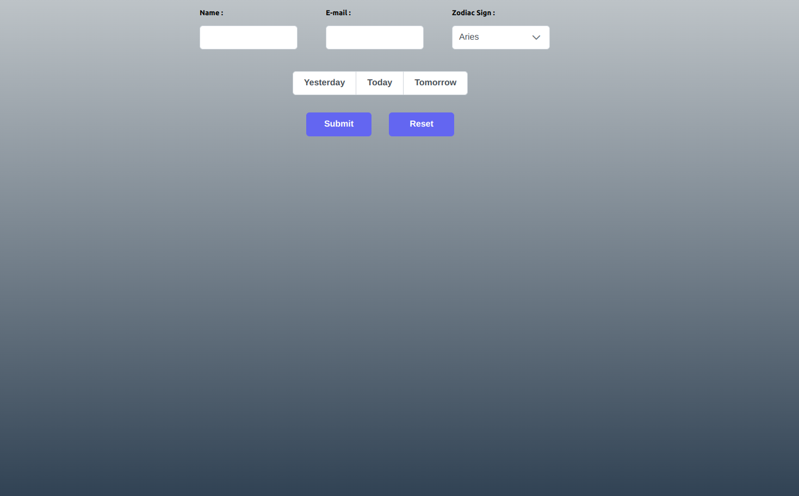
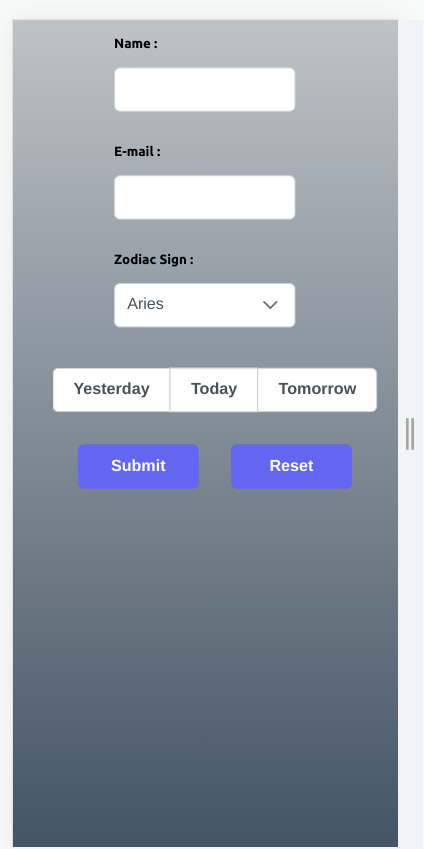

# Getting Started with Create React App

This project was bootstrapped with [Create React App](https://github.com/facebook/create-react-app).

# Develop a ReactJS horoscope app

This is a solution to the [A ReactJS horoscope app] 

## Table of contents

- [Overview](#overview)
  - [The challenge](#the-challenge)
  - [Screenshot](#screenshot)
- [My process](#my-process)
  - [Built with](#built-with)
  - [What I learned](#what-i-learned)
  - [Useful resources](#useful-resources)

## Overview

### The challenge

React.JS Task
Develop a ReactJS horoscope app using the following details:
- UI should have input provision for the following,
- Upon adding all required input fields the UI should display the horoscope
details which should include (but not limited to):
- Horoscope data should be fetched from an online public API
- Horoscope sign (Leo, Libra, Aquarius etc)
    - - Name
    - - Horoscope date (today, tomorrow or yesterday)
    - - Email address
    - - Submit button to fetch the horoscope details
    - - Name of the User
    - - Horoscope date
    - - Horoscope description
    - - Horoscope sign
Bonus Points:
- Use ReactJS
- Form validation
- All fields are required
- Email address validation
- If the current date falls within the entered horoscope date, the UI
should indicate so
- eg. If the horoscope sign selected is "Capricorn" (date range: Dec
22 - Jan 19) and today's date is Jan 17, the horoscope
description's background colour will be displayed with an
alternate colour.
- Details persist on page refresh
- UI should be a single page UI with all components accessible at all
times
- UI should be optimized for laptop screens (1024px minimum)
- Bonus if optimized for mobile screens (425px)
- Use React UI Component library - "PrimeReact"

### Screenshot

## My process

### Built with

- Semantic HTML5 markup
- CSS custom properties
- CSS Grid
- Mobile-first workflow
- Axios
- moment
- [React](https://reactjs.org/) - JS library
- [Primereact](https://www.primefaces.org/primereact/) - JS Library

### What I learned

- Integrating API's.
- Primereact - A React JS components library.
- Axios for API Integration.
- moment - The moment module is used for parsing, validating, manipulating, and displaying dates and times in JavaScript.

### Useful resources

- [Primereact](https://www.primefaces.org/primereact/) - This helped me to learn how to use Primereact library components. I'd recommend it to anyone still learning this concept.

## Available Scripts

In the project directory, you can run:

### `npm start`

Runs the app in the development mode.\
Open [http://localhost:3000](http://localhost:3000) to view it in your browser.

The page will reload when you make changes.\
You may also see any lint errors in the console.

### `npm test`

Launches the test runner in the interactive watch mode.\
See the section about [running tests](https://facebook.github.io/create-react-app/docs/running-tests) for more information.

### `npm run build`

Builds the app for production to the `build` folder.\
It correctly bundles React in production mode and optimizes the build for the best performance.

The build is minified and the filenames include the hashes.\
Your app is ready to be deployed!

See the section about [deployment](https://facebook.github.io/create-react-app/docs/deployment) for more information.

### `npm run eject`

**Note: this is a one-way operation. Once you `eject`, you can't go back!**

If you aren't satisfied with the build tool and configuration choices, you can `eject` at any time. This command will remove the single build dependency from your project.

Instead, it will copy all the configuration files and the transitive dependencies (webpack, Babel, ESLint, etc) right into your project so you have full control over them. All of the commands except `eject` will still work, but they will point to the copied scripts so you can tweak them. At this point you're on your own.

You don't have to ever use `eject`. The curated feature set is suitable for small and middle deployments, and you shouldn't feel obligated to use this feature. However we understand that this tool wouldn't be useful if you couldn't customize it when you are ready for it.

## Learn More

You can learn more in the [Create React App documentation](https://facebook.github.io/create-react-app/docs/getting-started).

To learn React, check out the [React documentation](https://reactjs.org/).

### Code Splitting

This section has moved here: [https://facebook.github.io/create-react-app/docs/code-splitting](https://facebook.github.io/create-react-app/docs/code-splitting)

### Analyzing the Bundle Size

This section has moved here: [https://facebook.github.io/create-react-app/docs/analyzing-the-bundle-size](https://facebook.github.io/create-react-app/docs/analyzing-the-bundle-size)

### Making a Progressive Web App

This section has moved here: [https://facebook.github.io/create-react-app/docs/making-a-progressive-web-app](https://facebook.github.io/create-react-app/docs/making-a-progressive-web-app)

### Advanced Configuration

This section has moved here: [https://facebook.github.io/create-react-app/docs/advanced-configuration](https://facebook.github.io/create-react-app/docs/advanced-configuration)

### Deployment

This section has moved here: [https://facebook.github.io/create-react-app/docs/deployment](https://facebook.github.io/create-react-app/docs/deployment)

### `npm run build` fails to minify

This section has moved here: [https://facebook.github.io/create-react-app/docs/troubleshooting#npm-run-build-fails-to-minify](https://facebook.github.io/create-react-app/docs/troubleshooting#npm-run-build-fails-to-minify)
